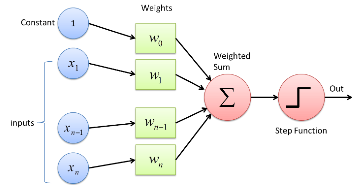
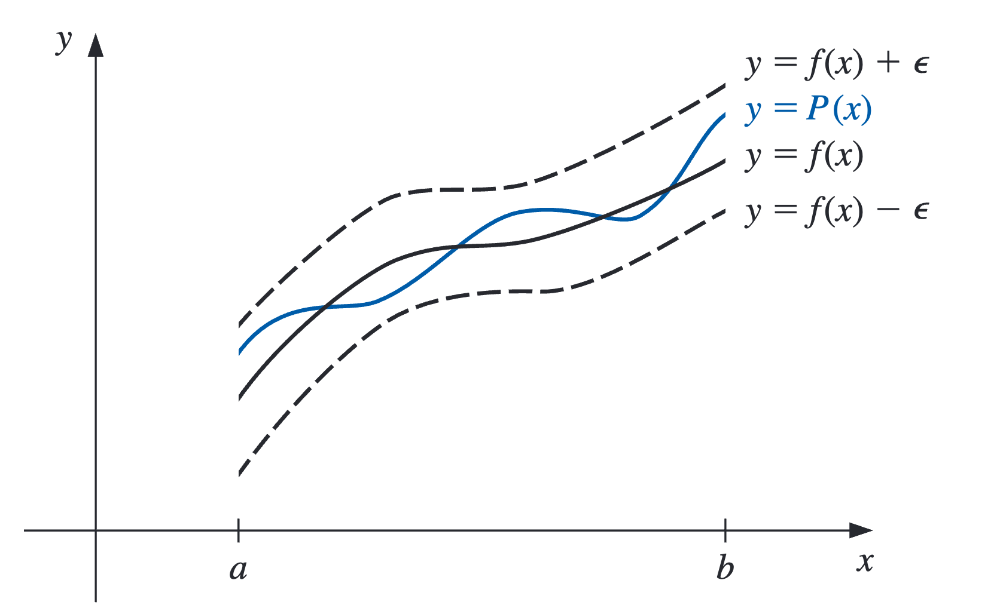
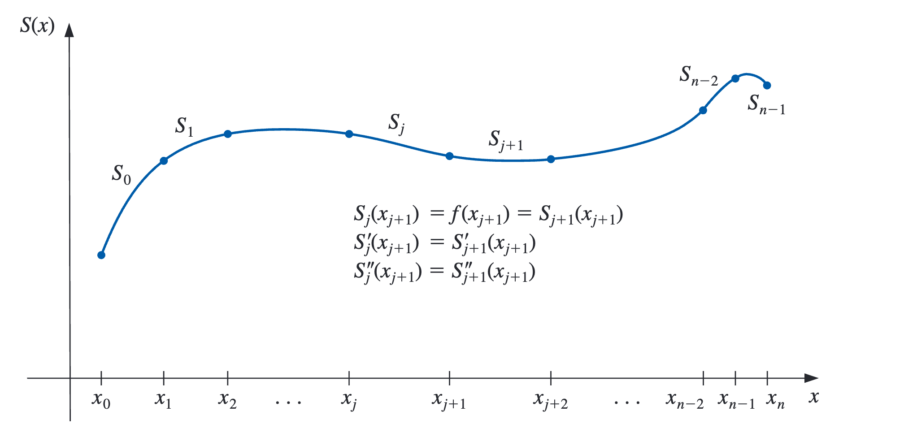

---
title:
  - Kolmogorov–Arnold Networks
author:
  - Yifeng He
theme:
  - Copenhagen
date:
  - May 15, 2024
---

# Background and Motivation

## Curve Fitting with MLP

---

Is there other ways to represent a curve?

## Interpolation and the Lagrange Polynomial

We are given a set of points 
$A  = \{ (x_i, y_i) | x_i, y_i \in \mathbb{R} \}$,
we want to find a (continuous) function 
$f : \mathbb{R} \rightarrow \mathbb{R}$ 
such that $f$ goes through all points in $A$.
Then $f$ can be expressed in polynomial form
$$
P_n(x) = a_n x^n + a_{n-1}x^{n-1} + \cdots + a_1x + a_0
$$
where $n$ is a nonnegative integer and $a_0, \ldots , a_n$ are real constants.
We say this is a $n$th degree approximation of $f$.

**Weierstrass Approximation Theorem (WAT)**.
Suppose $f$ is defined and continuous on [a, b]. For each $\epsilon > 0$, 
there exists a polynomial P(x), with the property that
$$
|f(x) - P(x)| < \epsilon, \forall x \in [a, b].
$$

## Why Polynomial Interpolation?

WAT $\implies$ uniform approximation.

Given any function, defined and continuous on a closed and bounded interval, there exists
a polynomial that is as “close” to the given function as desired.

{height=50%}

## Why it is not widely used in ML?

To pass through $n$ points
$$
\{ x_0, f(x_0)), (x_1, f(x_1)), \ldots, (x_{n-1}, f(x_{n-1}) \}
$$
we need a polynomial of degree $n - 1$.

However, real datasets often contain *a lot* of points.
When the degree $n$ is very large,
polynomials can oscillate erratically.

## Cubic Spline Interpolation

One way to overcome the oscillate problem is to limit the degree $n$.
That is, divide $f$ into different sections and interpolate a polynomial
with smaller degree for each section.

{height=55%}

## Remaining Problem

In real applications, data is **multivariate**.
For example, in the formula of linear regression
$$
\hat{y} = X\beta + \epsilon
$$
or 
$$
\hat{y_i} = \beta_0 + \beta_1 x_{i1} + \cdots + \beta_p x_{ip} + \epsilon_{i}
$$
for $i = 1, \ldots, n$.
i.e. You can (and should) use multiple predictors/features.

However, polynomial interpolation is **univariate**.

# KAN: Kolmogorov–Arnold Networks

## Kolmogorov-Arnold Representation Theorem

If $f$ is a multivariate continuous function on a bounded domain,
then $f$ can be written as a *finite composition* of continuous functions
of a single variable and the binary operation of addition.

That is, for a smooth $f : [0,1]^n \rightarrow \mathbb{R}$,
$$
f(X) = f(x_1, \cdots, x_n) = \sum_{q=1}^{2n+1} \Phi_q 
\left( \sum_{p=1}^{n} \phi_{q, p}(x_p) \right)
$$
where $\phi_{q, p} : [0, 1] \rightarrow \mathbb{R}$ 
and $\Phi_q : \mathbb{R} \rightarrow \mathbb{R}$.

## KRT to Machine Learning

Recall WAT, 
$f : [a, b] \rightarrow \mathbb{R}$ is just a parametric form of $\phi_{q, p}$
with fixed $a = 0, b = 1$.
Then we can represent a multivariate function  with just spline polynomials!

But how can we let the machine learn the spline polynomials $\phi_{q,p}$?

## Some Linear Algebra

Recall linear regression, where we learn a *linear transformation* of the predictors.
To apply back propagation, we need some *parameterized* form of the splines.

Recall from linear algebra, let $V$ be a vector space of finite dimension $n$ and
$$
B = \{ b_1, \ldots, b_n \}
$$
be the basis of $V$.
Then every vector $v$ in $V$ can be written as
$$
v = \lambda_1 b_1 + \cdots + \lambda_n b_n
$$
where $\lambda_i$s are *constants*.

## B-spline

The set of all cubic splines on $[0, 1]$ form a vector space $V$.
Let
$$
B = \{ B_1, \ldots, B_n\}
$$
be the basis functions of $V$, 
then every spline function $\phi$ can be written as
$$
\phi(x) = \sum_{i = 0}^{n} \lambda_i B_i(x).
$$
Then we have a parametrized form of non-linear functions.

In other words,
now we can use back propagation to learn activation functions! :)

---

## Kolmogorov-Arnold Representation Network

Now it is clear what is a layer in KAN is
$\Phi = \{ \phi_{q, p} \}$
where $p = 1, 2, \cdots, n_{in}$ and
$q = 1, 2, \cdots, n_{out}$,
is just a set of *learned* non-linear activations.

Then KAT is just a 2 layer KAN with
first layer $n_{in} = n$ and $n_{out} = 2n + 1$,
and the second layer with $n_{in} = 2n + 1$ and $n_{out} = 1$.

Then we can start stacking layers. :smiley:
$$
KAN(X) = (\Phi_{L-1} \circ \Phi_{L-2} \circ \cdots \circ \Phi_{1} \circ \Phi_{0}) X.
$$

## Compared to MLP

