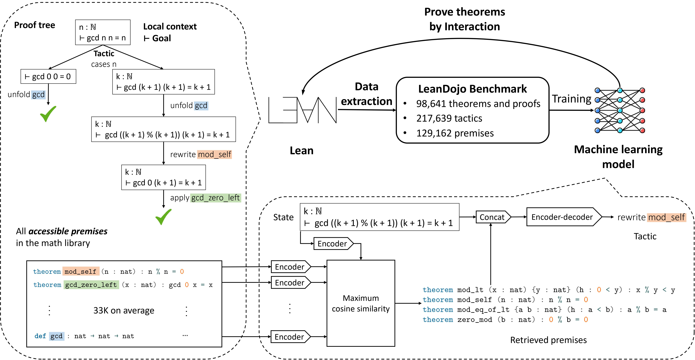
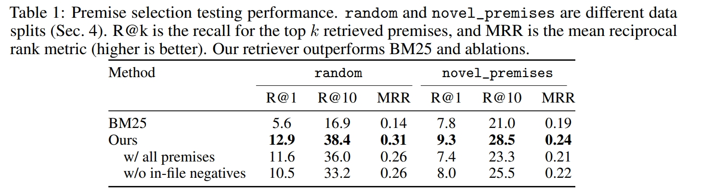
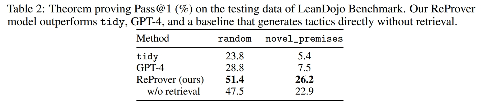

---
title:
  - LeanDojo
author:
  - Yifeng He
theme:
  - Copenhagen
date:
  - Sep 19, 2023
---

# Background

## Proof Assistant Languages

- Originated from logical programming, which was the first attempt to develop **Artificial Intelligence**

### Terminology

- state: current state of the theorem
- tactic: a function that takes a state and returns a new state
- premise: proved theorems/pre-defined functions to be used in tactics

## Curry-Howard Correspondence

| Logic       | Programming                |
| ----------- | -------------------------- |
| Proposition | Type                       |
| Theorem     | Function Definition        |
| Proof       | Implementation of Function |

$\implies$ LLM theorem proving $\approx$ code generation in a Dependent Type Language.

# Approach

## LeanDojo Benchmark/Dataset

1. _File dependencies_: directed acyclic graph, nodes are files and edges are relations between files
2. _ASTs_ of all files
3. _States and tactics_: process all proofs to (PrevState, Tactic, NextState) triples
4. _Premises_: recode where is defined and used on ASTs.

## ReProver

# Evaluation

## Premise Selection

Given current state, predict the tactic to use.

## Theorem Proving

<!-- Theorem Proving -->
