---
title:
  - NNSmith
author:
  - Yifeng He
theme:
  - Copenhagen
date:
  - Sep 19, 2023
---

# NNSmith: Generating Diverse and Valid Test Cases for Deep Learning Compilers

Jiawei Liu, Jinkun Lin, Fabian Ruffy, Cheng Tan, Jinyang Li, Aurojit Panda, Lingming Zhang

# Background

## Deep Learning Compilers

Model in Python $\rightarrow$ **Computation Graph** $\rightarrow$ exec

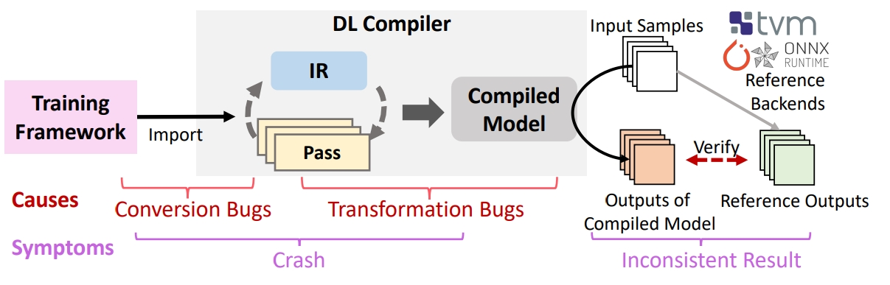

## Computation Graph

A directed graph of tensor operators.

- tensor operators: `Conv`, `Add`, `Mult`, ...
- tensor type: both shape and element type of tensor
  - For example, `nn.Linear(32 * 32 * 3, 110)`'s input
    should be a tensor $t \in \mathbb{R}^{3072}$.

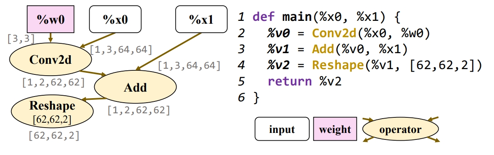

## Computation Graph Cont'

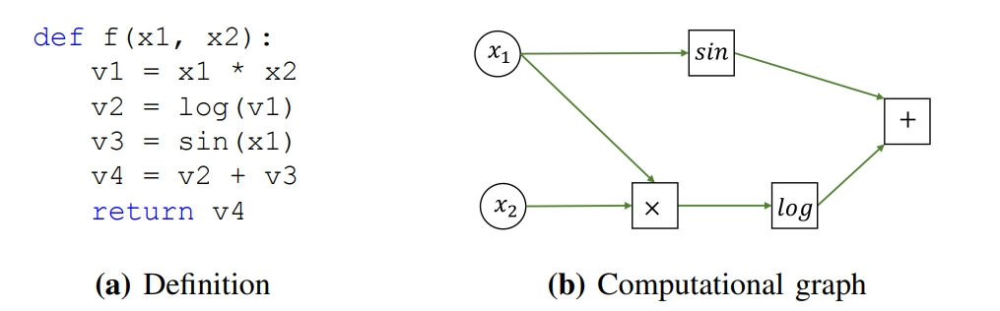

$$
f(x_1, x_2) = \log(x_1 \cdot x_2) + \sin(x_1)
$$

## Challenges

1. Generating valid graph with diverse patterns
   - most works are testing single operator
2. trivial artibutes like `Ones(1, 1, 1)`
3. Getting numeric invalid values `NaN`/`Inf`

# Design

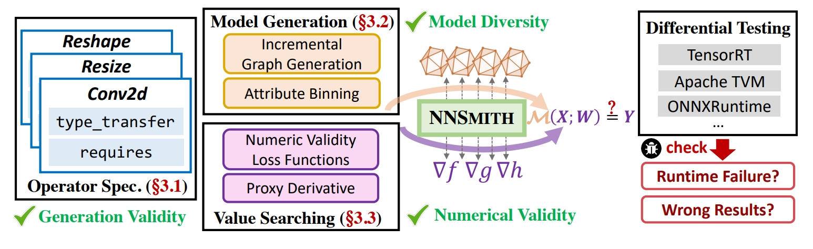

## Operator Specification

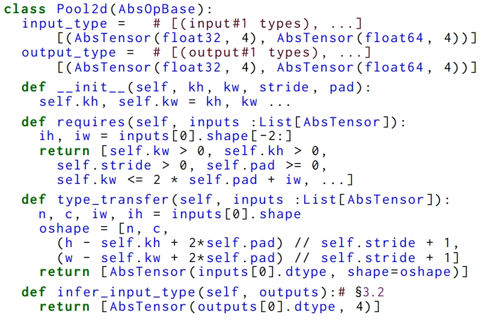

## Model Generation

Given a set of operator specifications,
uses an SMT solver to create computation graphs that meet the compiler's type-checking requirements.

---

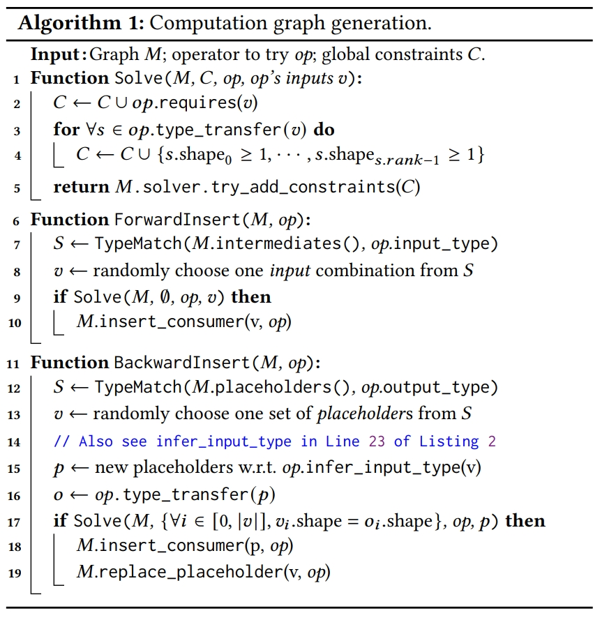

---

General Process:

1. Get constrains from operator specifications
2. Use SMT solver to find there to insert operator node
3. insert node
   1. forward insertion: for a `op` node, find a set of plausible tensor nodes `v` as input
   2. backward insertion: find tensor nodes `v`, replace its placeholder operator with solved `op` node.

## Improving Numeric Validity with Gradients

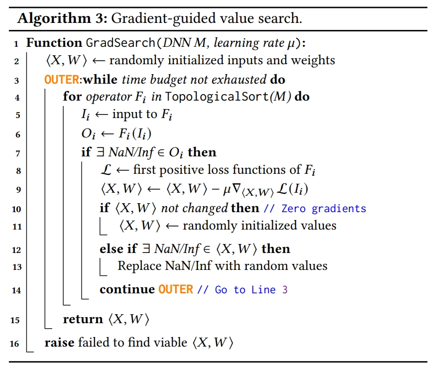{ height=250px }

# Evaluation

## Coverage

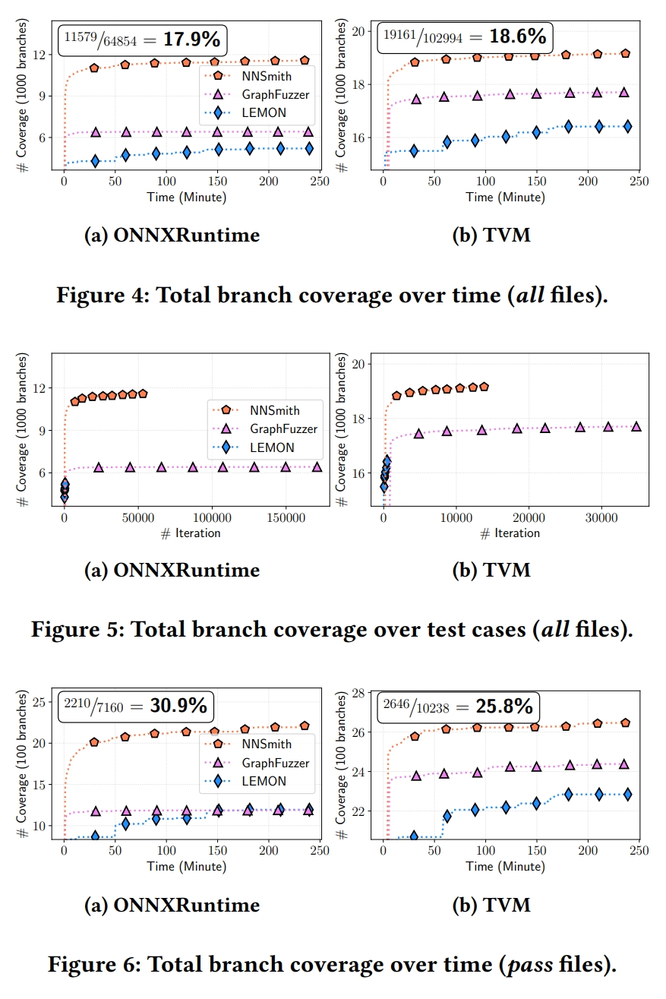

---

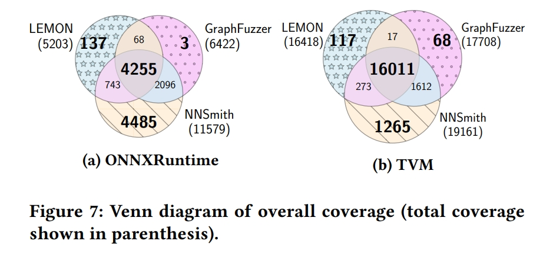

---

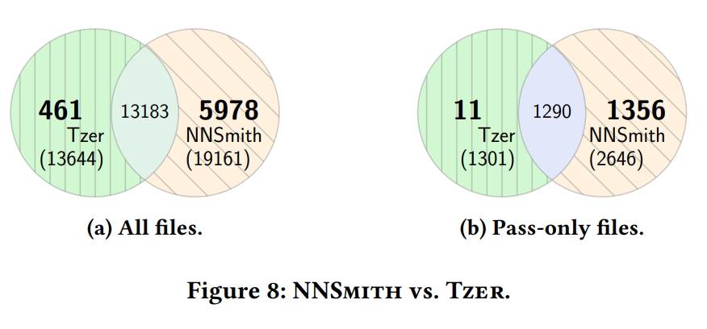

## Bugs Found

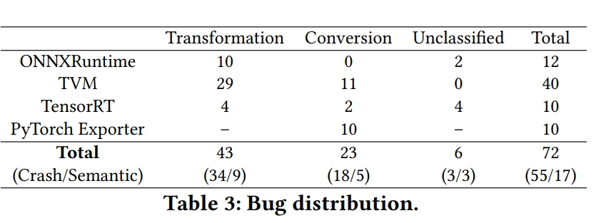
