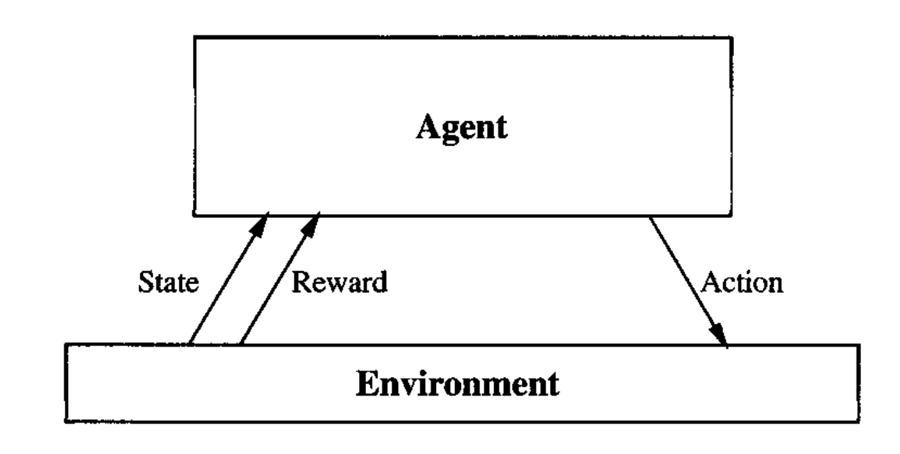
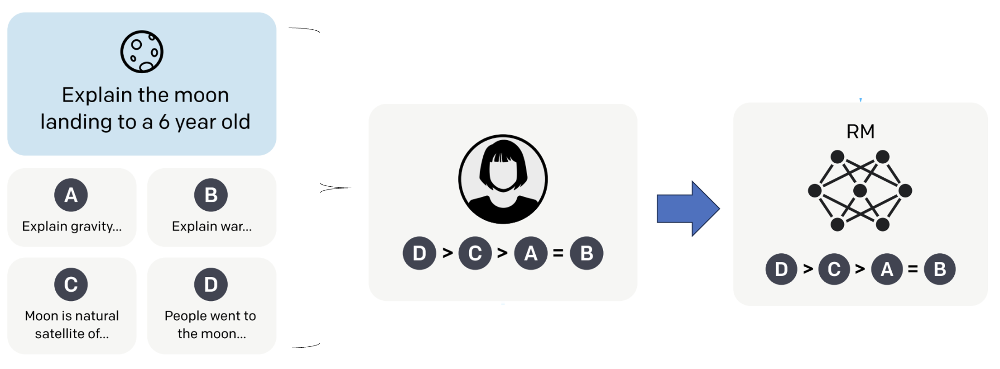
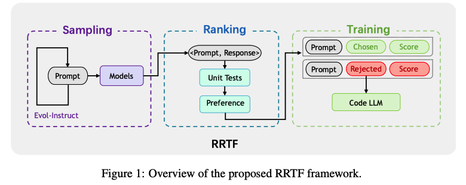
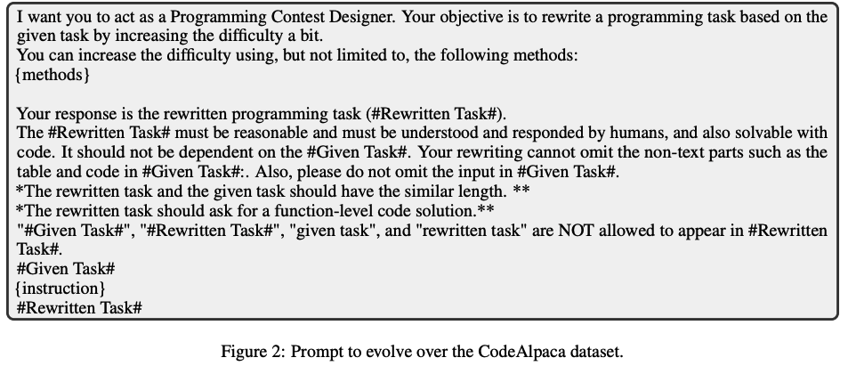
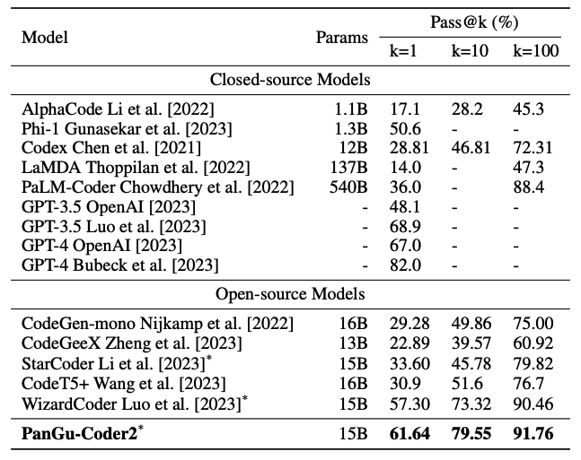
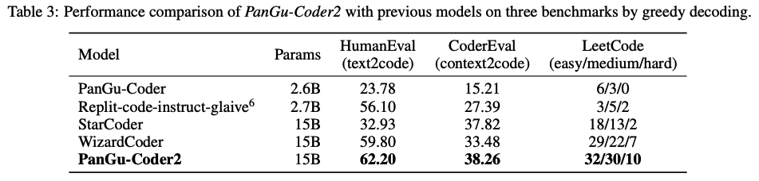
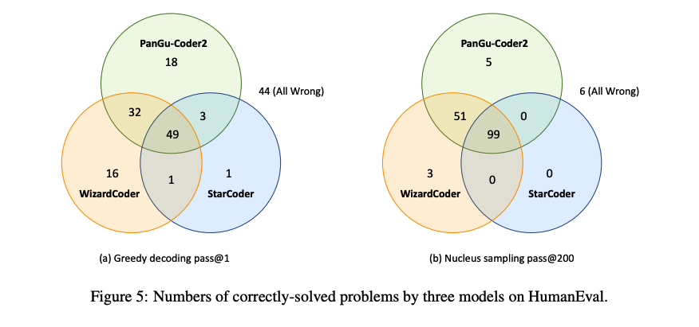

---
title:
  - PanGu-Coder2
author:
  - Yifeng He
theme:
  - Copenhagen
date:
  - Aug 4, 2023
---

# Background

## Code-LLM

LLMs for code are usually trained on a large corpus of code-related data,
and are often categorized into two types of tasks:

- **code generation**: LLMs write code
- code understanding: given code, find similar code or bug.

## Reinforcement Learning (RL)

- example: AlphaGo

## LLM RL from Human Feedback

- example: ChatGPT

# Approach

**RRTF** (**R**ank **R**esponses to align **T**est&**T**eacher **F**eedback) framework

## Sampling

1. LLM generates additional (evolve over) the origional dataset, following [Evol-Instruct](https://arxiv.org/abs/2304.12244).
2. Models generate responses to the same prompt
   1. Student model: LLM to train
   2. Teacher model: a more powerful LLM or human expert (or ...)
3. Sample responses from both model with given temperature (hyperparameter)

## Sampling (cont.)

## Ranking

assign score to responses based on unittests:

- compiled error
- runtime error
- pass partial tests
- all pass (correct tests)

_heuristic preferences_

- filter out pairs where teacher's score < student's score
- same situation, then assign higher score to teacher

## Training

Fine-tuning [StarCoder](https://huggingface.co/blog/starcoder) with new loss function

$$
L = L_{rank} + L_{ft},
$$

where $L_{rank}$ is the ranking loss given by conditional probability
and $L_{ft}$ is the fine-tuning cross-entropy loss.

# Evaluation

## HumanEval Dataset

{ height=200px }

## All Three Benchmarks

# Case Study

