---
title:
  - SWE-Bench Can Language Models Resolve Real-World GitHub Issues?
author:
  - Yifeng He
theme:
  - Copenhagen
date:
  - May 2, 2024
---

# Yet another code generation benchmark?

## What wrong with the popular benchmarks?

### HumanEval (OpenAI, 2021)

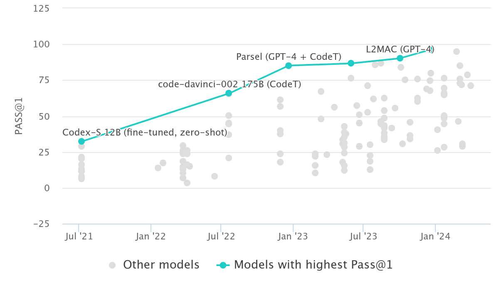

---

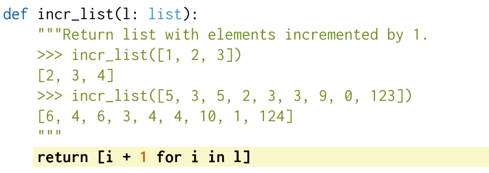

### Mostly Basic Programming Problems MBPP (Google, 2021)

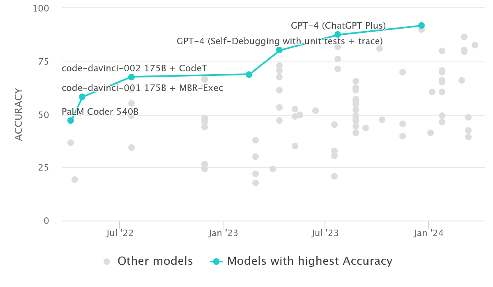

---

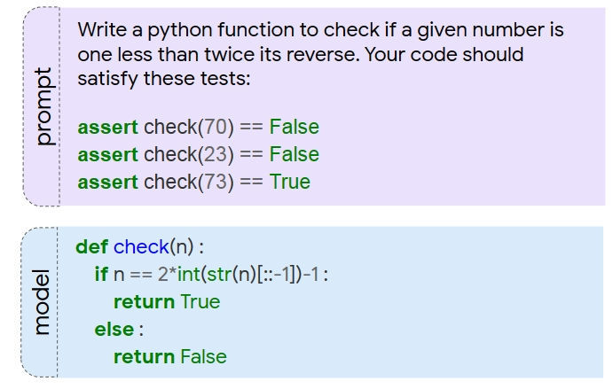{height=60%}

### SWE-Bench

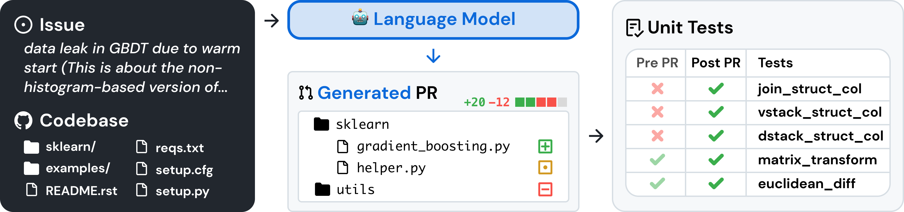

* result easily verifiable: pre-defined test suite 
* realistic: user-submitted issues and solutions
* diverse: 12 different OSS
* extensible: continuously update the benchmark with new issue/PR pairs

# Design

## Benchmark construction

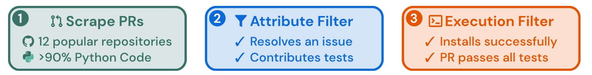

1. Data scraping: from 12 popular Python repos, collected $\sim 90,000$ PRs
   * popular repos are better maintained, have clear contributor guidelines, and have better test coverage
2. Attribute-based filtering
   1. *merged* PR with associate issue (makes a task instance)
   2. make changes to a *test* file, indicate that this PR contribute solve the issue
3. Execution-based filtering: at least one *fail-to-pass* test

---

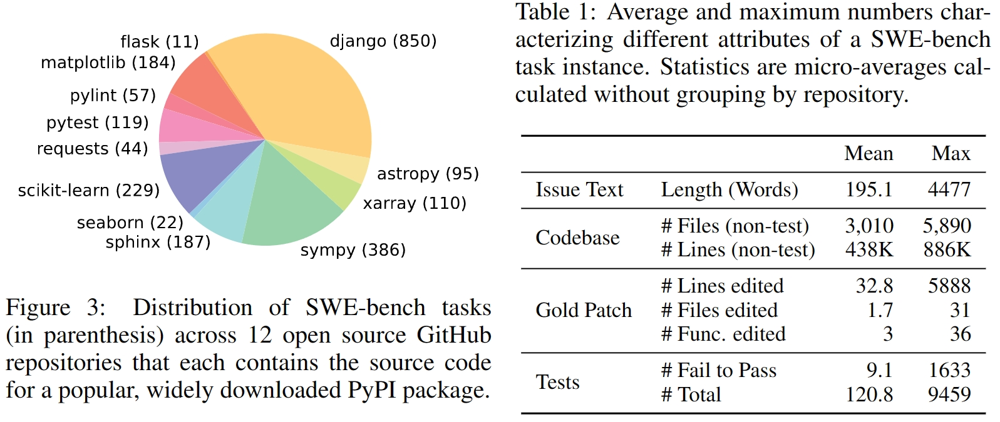

* Total: 2,294 tasks
* Issue descriptions are short compared to codebase
* Codebase are large with thousands of files
* Pull requests often make changes to multiple files *at once*

$\implies$ codebase, the context of a patch, is too large for LLMs.

## Task Description

### Task formulation

* Model input: issue text description + complete codebase
* Task: make an edit to the codebase to resolve the issue
  * edit: generate *patch* files
* Evaluation metrics: apply patch files and see if they resolve the issue 
  * resolve the issue: same *fail-to-pass* test

### Features

* Real-world SE tasks
* Continually updatable
* Diverse long input
  * issue description is long and in detail, codebase has thousands of files
* Robust evaluation
  * at least 1 *fail-to-pass* test
  * $40\%$ tasks have more than 2
  * a median of 51 additional tests to make check other functionality
* Cross-context code editing
* Wide scope for possible solutions

### Challenges

1. A codebase has thousands of files, how can it be fit in the context window?

# Experiments

## Results

### Retrieval for context

1. Sparse retrieval: BM25 (bag-of-words) to retrieve files relevant to issue description
2. "Oracle" retrieval: files edited by the PR

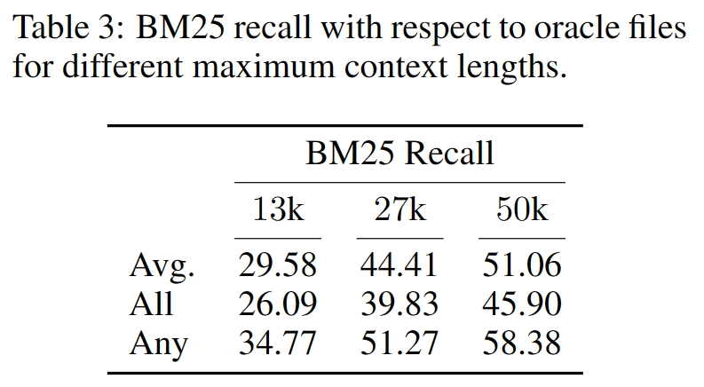{height=35%}

In $27k$ token limits, superset for $\sim 40\%$ instances,
mutually exclusive set for about half of the instances.

### Benchmark Results

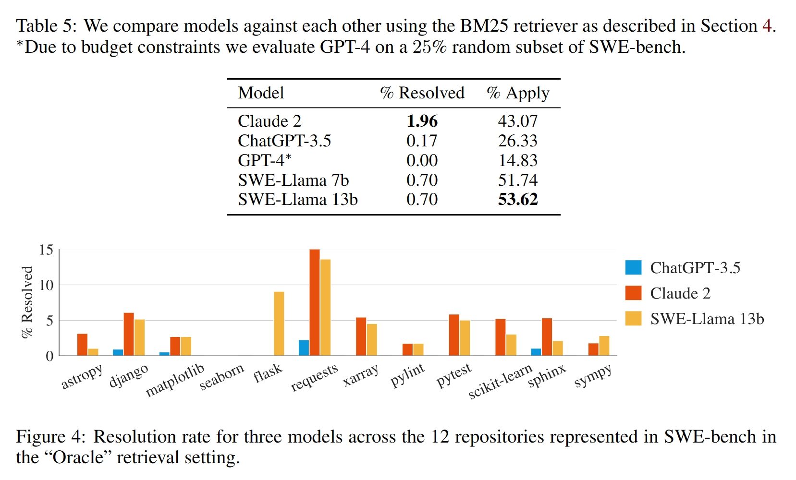

---

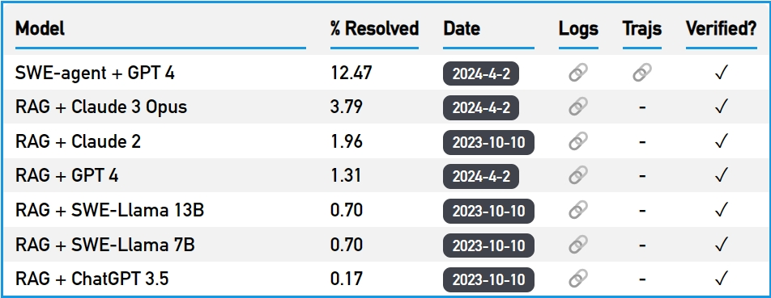

## What factors impact the difficulty of SWE tasks?

### Can LLM find the bug in long context?

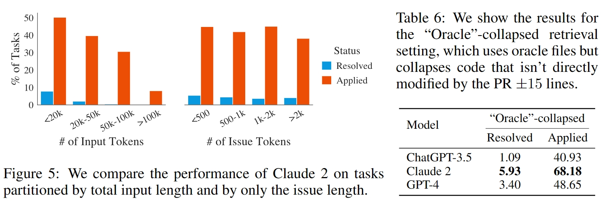

### Have the LLM seen this code already?

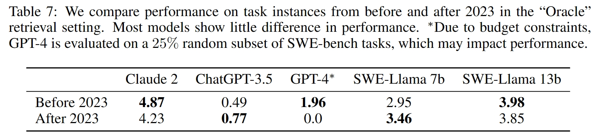

### Does poor root cause localization increase the difficulty?

* Fine-tuned SWE-Llama based on CodeLlama using "oracle" retrieval
* SWE-Llama is sensitive to context distribution shifts
  *  perform surprisingly poorly with BM25 retrieved context

### Is generating patch file hard?

* the models are trained on whole files instead of patch files, so hard to generate well-formatted patch files?
* Let the models generate wholes, but results are even worse
  * Claude2 scores $4.8\% \rightarrow 2.2\%$ with "oracle" retrieval

### Is LLMs making the solution over complex?

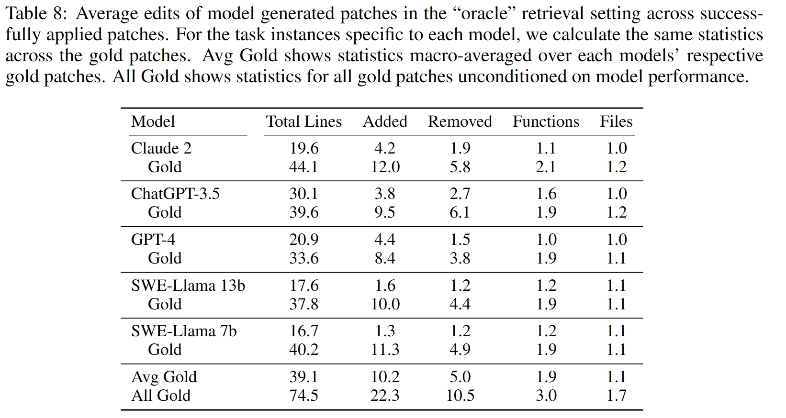

# Discussion

### Is this benchmark really maintainable?

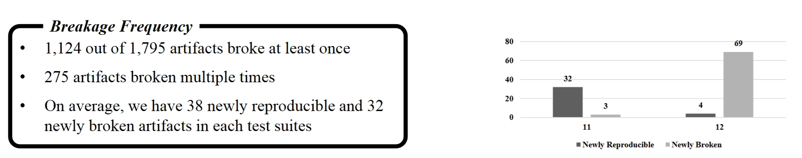
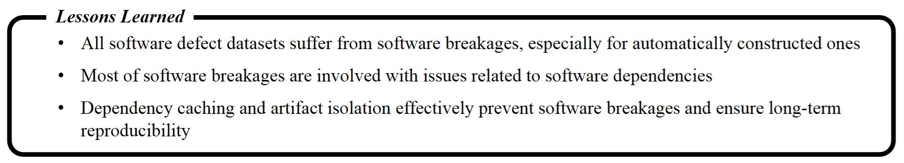

On the Reproducibility of Software Defect Datasets (ICSE 2023)